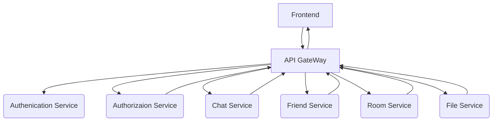
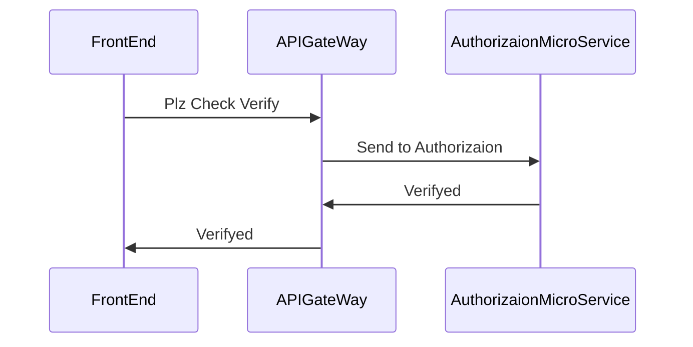
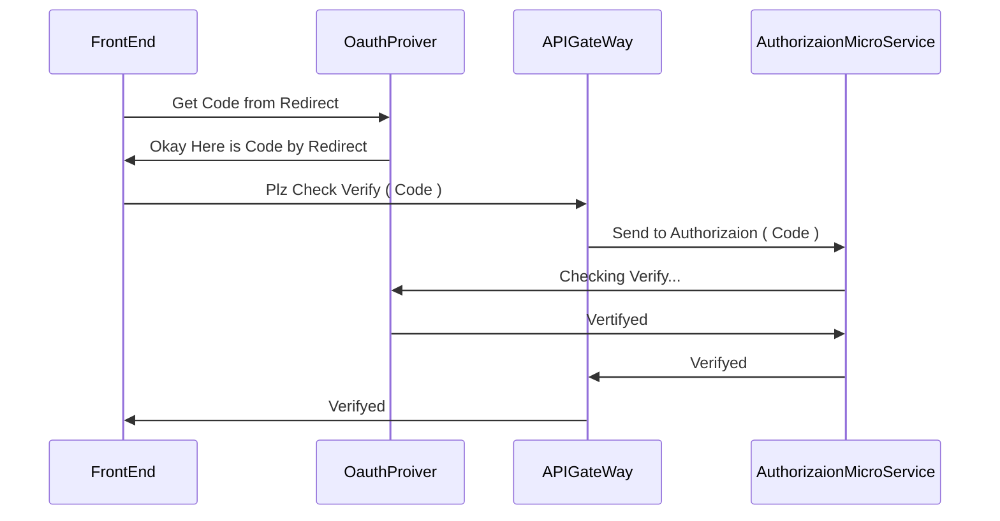

### Archtechture


### AuthGuard Sequence Diagram ( JWT Token )


### Oauth 2.0 Sequence Diagram


## Description
- 실시간 채팅 기능을 제공합니다.
- 프로필, 친구 기능을 제공합니다.


## TechSpec
- [x] OAuth 2.0
- [x] AuthGuard by JWT Token
- [x] Websocket Realtime Chatting
- [x] Redis Caching System
- [x] TypeORM ( MySQL )
- [x] Swagger API
- [x] CI/CD PipeLine ( Deploy, Test )

## Installation

```bash
$ npm install
```

## Running the app

```bash
# development
$ npm run start

# watch mode
$ npm run start:dev

# production mode
$ npm run start:prod
```

## Test

```bash
# unit tests
$ npm run test

# e2e tests
$ npm run test:e2e

# test coverage
$ npm run test:cov
```

## Swagger API
- [https://port-0-kakaotalk-apigateway-eu1k2lllawv5vy.sel3.cloudtype.app/api](https://port-0-kakaotalk-backend-eu1k2lllawv5vy.sel3.cloudtype.app/api)

## Open Server
- 아래의 링크에서 서비스를 확인 할 수 있습니다.
- https://web-kakaotalk-frontend-eu1k2lllawv5vy.sel3.cloudtype.app/
