# Chatting Server

## 프로젝트 개요

> 나만의채팅, 1:1, 그룹 실시간 채팅 기능을 제공하며, 사용자 프로필을 통하여 상태메세지, 배경화면, 프로필화면을 꾸밀 수 있으며, 친구 기능을 통하여 자기자신의 상태메세지를 다른 친구에게 보여줄 수 있습니다.
> 

[목표](resource/%E1%84%86%E1%85%A9%E1%86%A8%E1%84%91%E1%85%AD%20ff7fbfcc70134982a61bc62fd5293525.md)

[환경 구성](resource/%E1%84%92%E1%85%AA%E1%86%AB%E1%84%80%E1%85%A7%E1%86%BC%20%E1%84%80%E1%85%AE%E1%84%89%E1%85%A5%E1%86%BC%207c596d9910584b609c06d14ba6003ffc.md)

---

[권한기능](resource/%E1%84%80%E1%85%AF%E1%86%AB%E1%84%92%E1%85%A1%E1%86%AB%E1%84%80%E1%85%B5%E1%84%82%E1%85%B3%E1%86%BC%20638c96cf56d442838dbd5efc59ea3b03.md)

[유저/친구 기능](resource/%E1%84%8B%E1%85%B2%E1%84%8C%E1%85%A5%20%E1%84%8E%E1%85%B5%E1%86%AB%E1%84%80%E1%85%AE%20%E1%84%80%E1%85%B5%E1%84%82%E1%85%B3%E1%86%BC%209fb412eab3e2444dbac3cdfb18307b25.md)

[채팅기능](resource/%E1%84%8E%E1%85%A2%E1%84%90%E1%85%B5%E1%86%BC%E1%84%80%E1%85%B5%E1%84%82%E1%85%B3%E1%86%BC%20d748753423424e70975392713db3b94e.md)

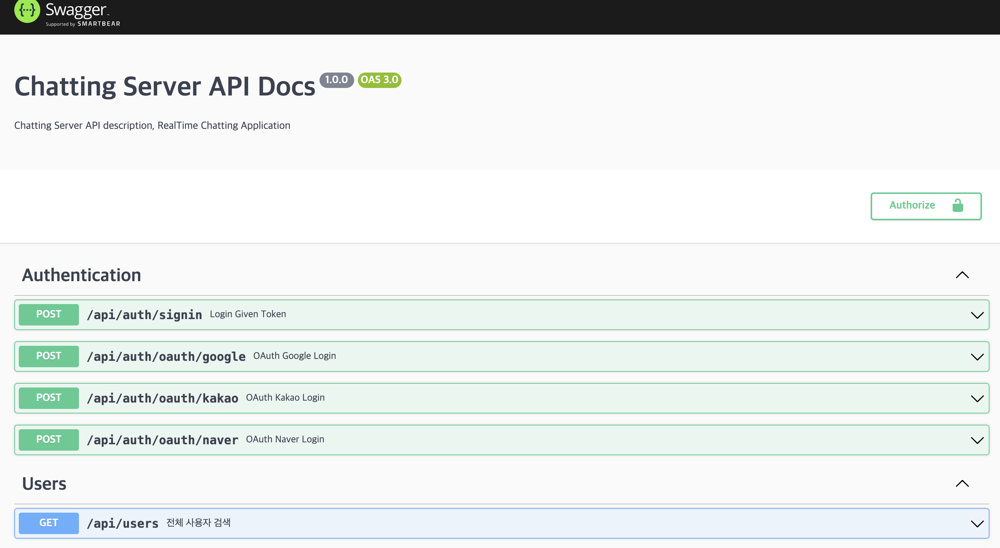

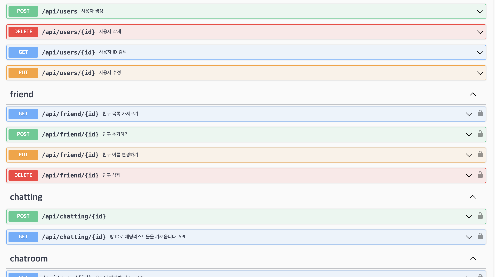

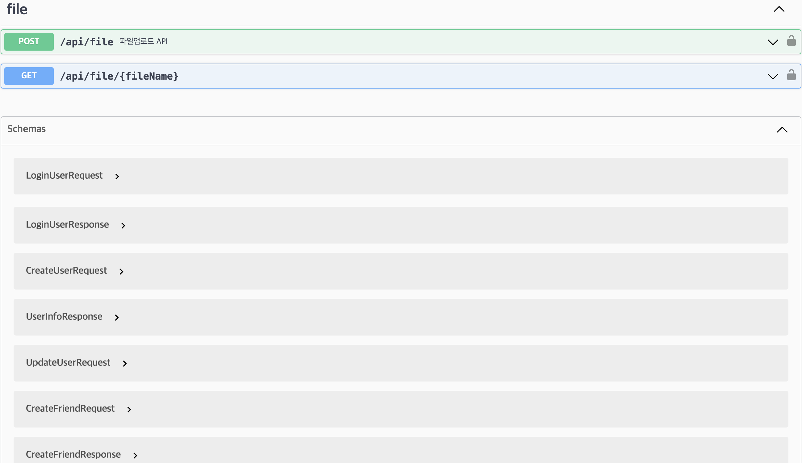

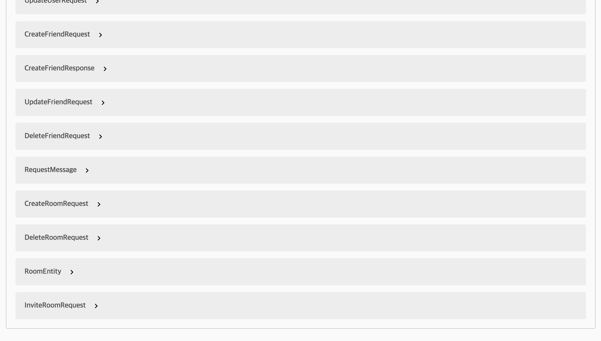

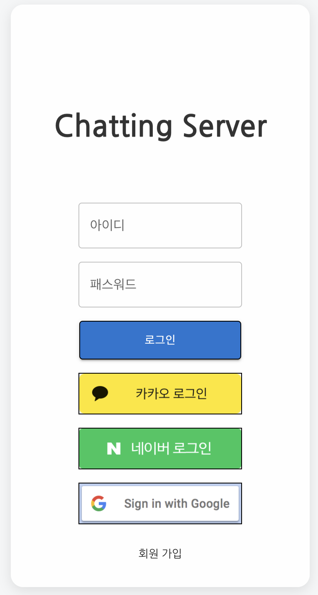

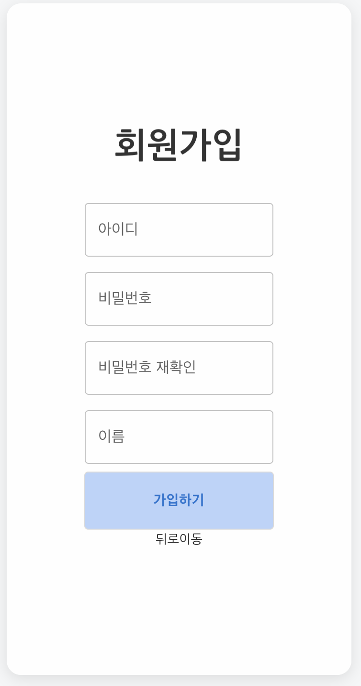

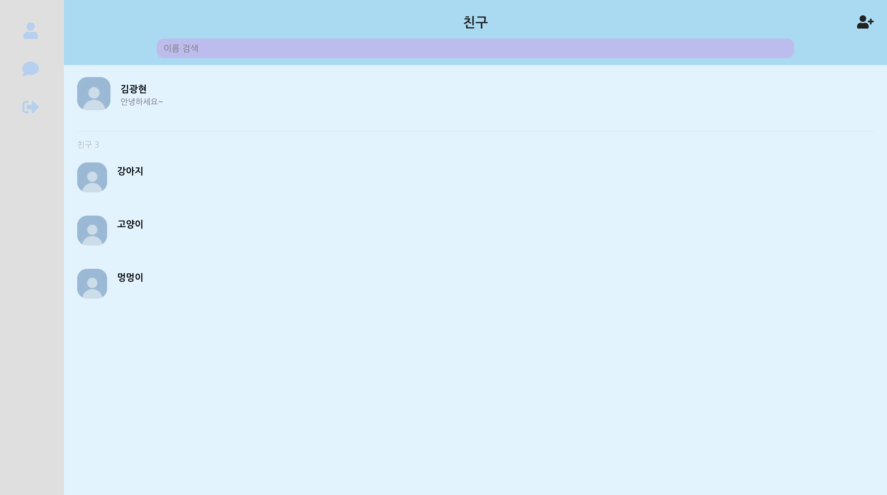

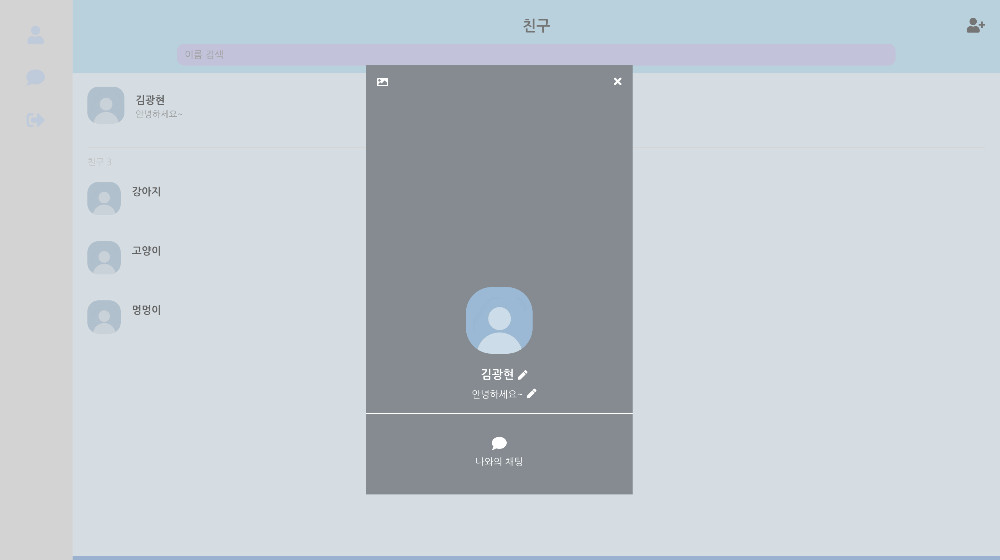


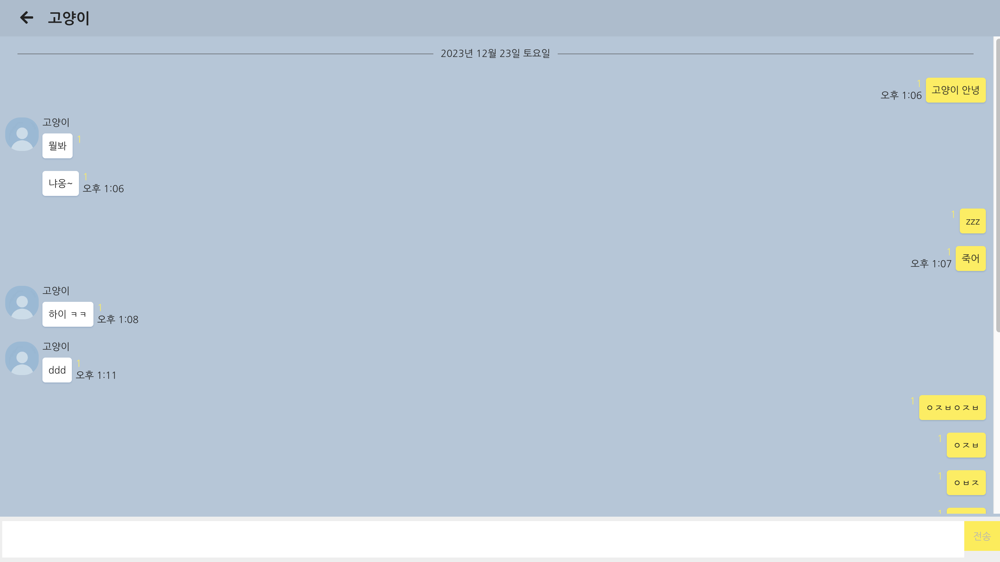

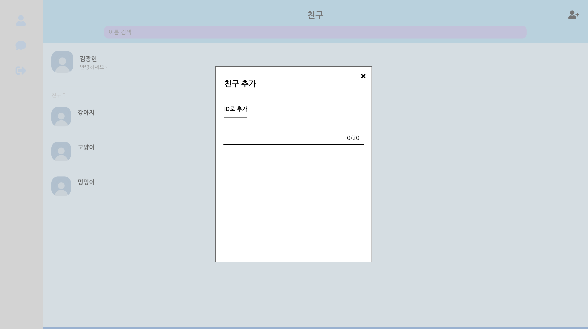

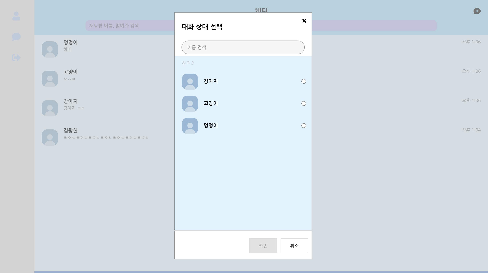

---

## Service Dependency

```mermaid
classDiagram
    class APIGateWay {
      <<module>>
    }
    class AuthModule {
      <<module>>
    }
    class UserModule {
      <<module>>
    }
    class ChatModule {
      <<module>>
    }
    class FileModule {
      <<module>>
    }
    class AuthenticationServiceModule {
      <<module>>
    }
    class AuthorizationServiceModule {
      <<module>>
    }
    class UserServiceModule {
      <<module>>
    }
    class ChatServiceModule {
      <<module>>
    }
    class AuthenticationService {
      <<service>>
    }
    class BcryptService {
      <<service>>
    }
    class UserRepositoryService {
      <<service>>
    }
    class JwtService {
      <<service>>
    }
    class AuthorizationService {
      <<service>>
    }
    class FriendRepositoryService {
      <<service>>
    }
    class UserService {
      <<service>>
    }
    class FriendService {
      <<service>>
    }
    class ChatRepositoryService {
      <<service>>
    }
    class RoomRepositoryService {
      <<service>>
    }
    class ChatGatewayService {
      <<service>>
    }
    class ChatService {
      <<service>>
    }
    class RoomService {
      <<service>>
    }

    APIGateWay --|> AuthModule
    APIGateWay --|> UserModule
    APIGateWay --|> ChatModule
    APIGateWay --|> FileModule

    AuthModule --|> AuthenticationServiceModule
    AuthModule --|> AuthorizationServiceModule
    AuthModule --|> UserServiceModule
    AuthModule --|> ChatServiceModule
    AuthenticationServiceModule --|> AuthenticationService
    AuthenticationServiceModule --|> BcryptService
    AuthenticationServiceModule --|> UserRepositoryService
    AuthenticationServiceModule --|> JwtService

    AuthorizationServiceModule --|> JwtService
    AuthorizationServiceModule --|> AuthorizationService

    UserServiceModule --|> UserRepositoryService
    UserServiceModule --|> FriendRepositoryService
    UserServiceModule --|> BcryptService
    UserServiceModule --|> UserService
    UserServiceModule --|> FriendService

    ChatServiceModule --|> ChatRepositoryService
    ChatServiceModule --|> RoomRepositoryService
    ChatServiceModule --|> ChatGatewayService
    ChatServiceModule --|> ChatService
    ChatServiceModule --|> RoomService
```

## Installation

```bash
$ npm install

```

## Running the app

```bash
# development
$ npm run start

# watch mode
$ npm run start:dev

# production mode
$ npm run start:prod

```

## Test

```bash
# unit tests
$ npm run test

# e2e tests
$ npm run test:e2e

# test coverage
$ npm run test:cov

```