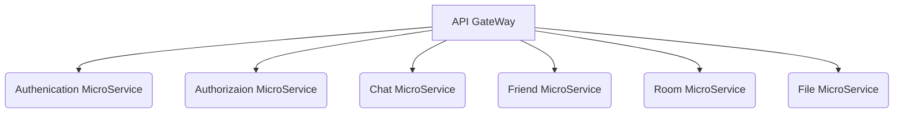
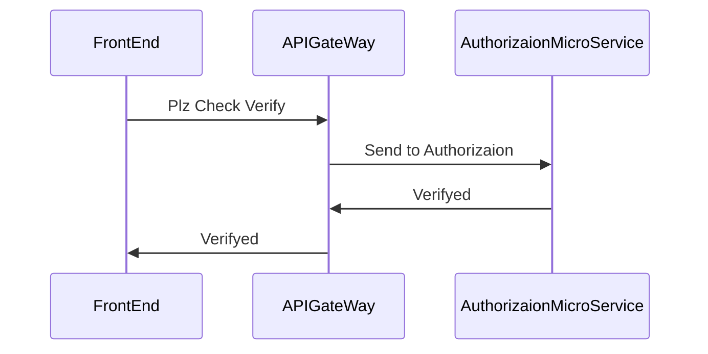
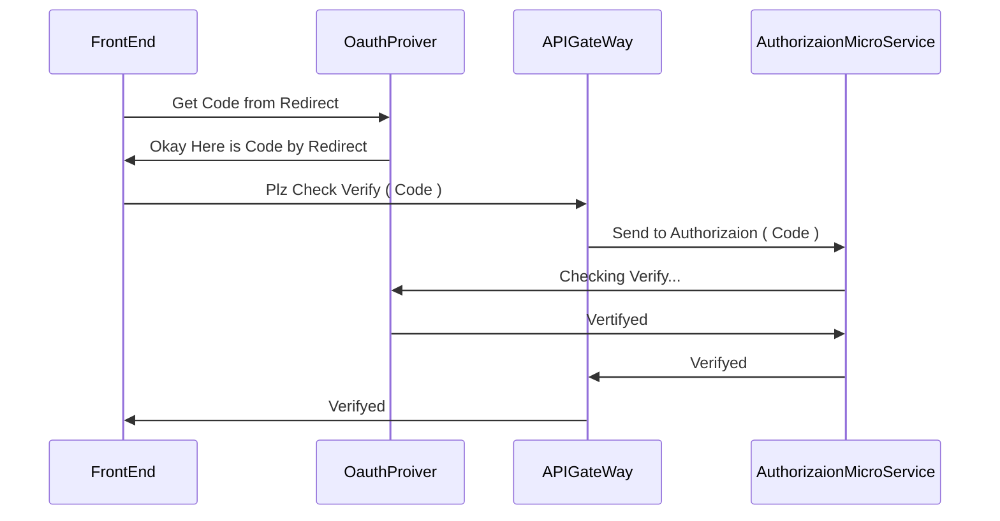

### Archtechture


### NormalAuthGuard Sequence Diagram ( JWT Token )


### OAUTH Sequence Diagram


## Description
- 프로필, 친구 기능을 제공합니다.
- 실시간 채팅 기능을 제공합니다.

## TechSpec
- OAuth (카카오,네이버,구글) 로그인 적용하였습니다.
- JWT Token으로 Guard Strategy를 적용하였습니다.
- WebSocket을 사용한 실시간 채팅을 보장합니다.
- 캐싱 시스템을 적용하여 DB 조회를 최소화 하였습니다. ( Redis 저장소 사용 )
- TypeORM을 도입하여 Object to Entity를 구현하였습니다.
- Swagger를 사용하여 API 명세서를 작성하였습니다.
- CI/CD 구축으로 테스트/배포 자동화 하였습니다.

## Installation

```bash
$ npm install
```

## Running the app

```bash
# development
$ npm run start

# watch mode
$ npm run start:dev

# production mode
$ npm run start:prod
```

## Test

```bash
# unit tests
$ npm run test

# e2e tests
$ npm run test:e2e

# test coverage
$ npm run test:cov
```

## Swagger API
- [https://port-0-kakaotalk-apigateway-eu1k2lllawv5vy.sel3.cloudtype.app/api](https://port-0-kakaotalk-backend-eu1k2lllawv5vy.sel3.cloudtype.app/api)

## Open Server
- 아래의 링크에서 서비스를 확인 할 수 있습니다.
- https://web-kakaotalk-frontend-eu1k2lllawv5vy.sel3.cloudtype.app/
