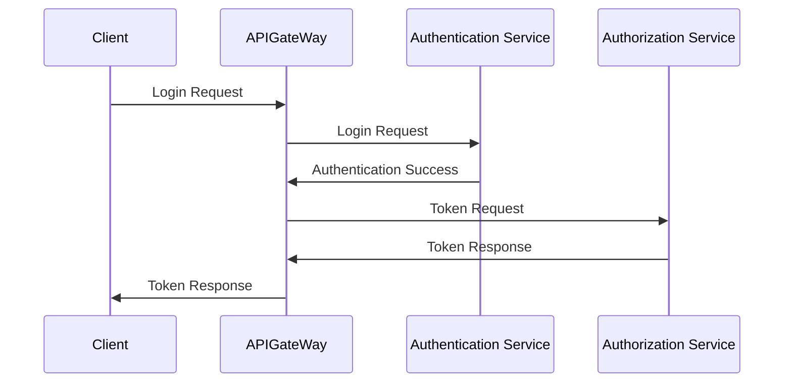
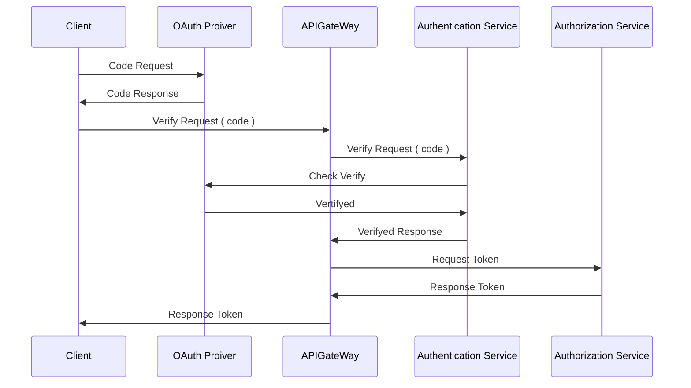
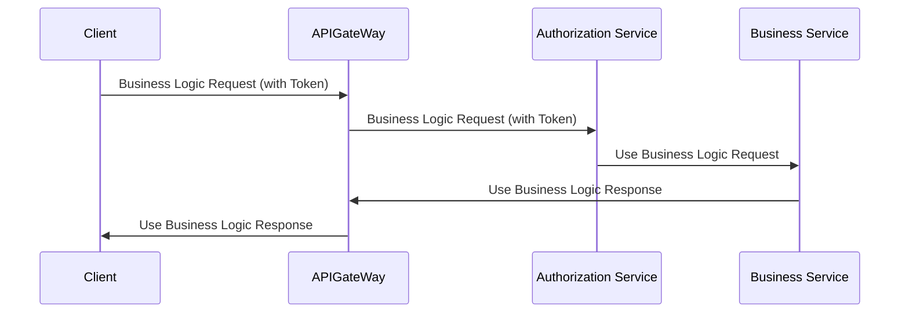

# 권한기능

---

### 기능

- 회원가입 / 회원탈퇴 기능을 제공합니다.
- OAuth 연동을 통한 로그인 기능을 제공합니다. ( 카카오, 구글, 네이버 )

### 비지니스 규칙

- 토큰 인증이 불허된 경우, 서버 자원에 접근 할 수 없습니다.
- 사용자는 자기자신의 자원만 접근 할 수 있습니다.
- 관리자, 사용자에 따라서 접근 할 수 있는 자원이 분리되어있습니다.

### 사용 기술

- NestJS의 Guard Strategy를 활용한 인증/인가 서비스를 구현하였습니다.
- JwtWebToken 서비스를 어텝터 패턴을 적용하여, 사용하고자하는 인터페이스를 구현하였습니다.
- Passport Strategy를 활용하여 OAuth 2.0을 구현하였습니다.

### Authentication Authorization Sequence Diagram

### OAuth 2.0 Sequence Diagram

### Resource Authorization Sequence Diagram

